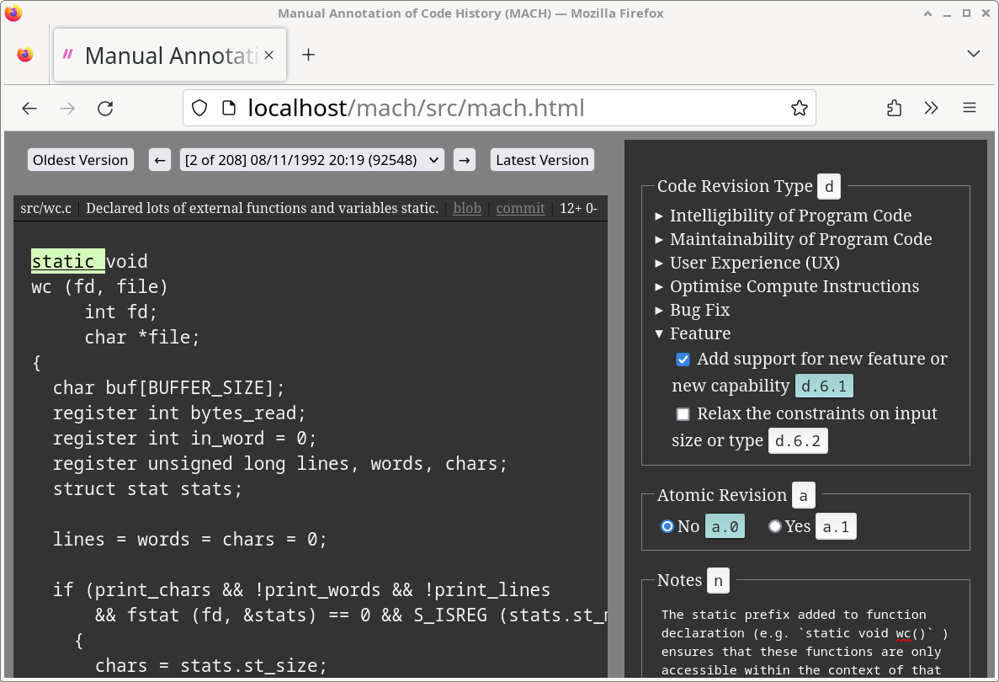

# Manual Annotation of Code History (MACH)

MACH is a software tool to manually annotate different stages
(e.g. commits in a version control system) of evolution of a software
code repository.

<figure>
  
  <figcaption>Manual Annotation of [GNU Coreutils](http://git.savannah.gnu.org/gitweb/?p=coreutils.git;a=summary) word count ([wc](http://git.savannah.gnu.org/gitweb/?p=coreutils.git;a=blob;f=src/wc.c)) tool</figcaption>
</figure>

## Background and History

The MACH tool was created by [Abhishek Dutta](https://abhishekdutta.org) to manually
annotate the different stages of evolution of the source code of
[word count (wc)](http://git.savannah.gnu.org/gitweb/?p=coreutils.git;a=blob;f=src/wc.c)
tool in [GNU Coreutils](http://git.savannah.gnu.org/gitweb/?p=coreutils.git;a=summary).
Such manual annotations &mdash; it is hoped &mdash; will provide a glimpse into how
a software evolves over time. The development of MACH started on 2023-Sep-23 with
an initial project name of Analysis of Code Evolution (ACE).

## Usage
The tool requires git repositories to be server over HTTP using the
dumb protocol. For now, we use the apache web server to host a git
repository over HTTP. In future, we will created a minimal web server
`mach-serve` that will avoid the need to run a full web server.

```
sudo apt-get install apache2
cd /home/tlm/code/mach/repo
git clone --bare /home/tlm/pub/lion/code/gnu-coreutils/git-src/coreutils coreutils.git
cd coreutils.git/
mv hooks/post-update.sample hooks/post-update
chmod a+x hooks/post-update

# make the git repository files accessible at http://localhost/coreutils.git/
cd /var/www/html/
sudo ln -s /home/tlm/code/mach/ mach
```

To run automatic tests for the MACH tool, open
[http://localhost/mach/src/mach-test.html](http://localhost/mach/src/mach-test.html)
link in a browser. Successful test run generates an output as shown below.

```
Test for Manual Annotation of Code History (MACH)
Use Ctrl + o to load a project, press F1 for help.
[22/06/2024, 08:06:41] TEST 0 : , 0 : PASS, 1 : PASS
[22/06/2024, 08:06:41] TEST 1/9 : , 0 : PASS, 1 : PASS
[22/06/2024, 08:06:41] TEST 2/9 : , 0 : PASS, 1 : PASS
[22/06/2024, 08:06:41] TEST 3/9 : , 0 : PASS, 1 : PASS
[22/06/2024, 08:06:41] TEST 4/9 : , 0 : PASS, 1 : PASS
[22/06/2024, 08:06:41] TEST 5/9 : , 0 : PASS, 1 : PASS
[22/06/2024, 08:06:41] TEST 6/9 : , 0 : PASS, 1 : PASS
[22/06/2024, 08:06:41] TEST 7/9 : , 0 : PASS, 1 : PASS
[22/06/2024, 08:06:41] TEST 8/9 : , 0 : PASS, 1 : PASS
[22/06/2024, 08:06:41] TEST 9/9 : , 0 : PASS, 1 : PASS
[22/06/2024, 08:06:41] All 9 tests passed successfully
```

## Docs
  - Screenshot: [Manual Annotation of word count (wc) tool](docs/screenshots/mach-gnucoreutils-wc.png)
  - [Demo Video](https://www.youtube.com/watch?v=m-bR7TQN00E)
  - Demo MACH project (press `Ctrl + o` in MACH tool to load these projects)
    - [GNU Coreutils word count (wc) tool](data/gnu-coreutils/wc/mach-36a6c8-20231217-1010.json) (initial version from 2023-12-17)
    - [GNU Coreutils word count (wc) tool](data/gnu-coreutils/wc/mach-36a6c8-20240105-0621.json) (final version from 2024-01-05)
  - [Formatting Content of Attributes with Input Type of TextArea](docs/Textarea-Formatting.md)

## Contact
Contact [Abhishek Dutta](mailto:adutta.np@gmail.com) for any queries or feedback
related to the MACH tool.